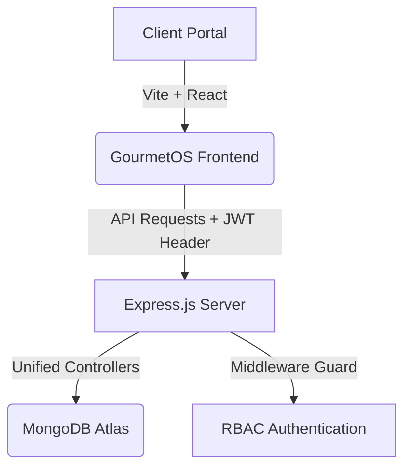

# GourmetOS - Project Architecture & Technical Specification

Welcome to the **GourmetOS** technical documentation. This document details the system design, directory structure, database models, role-based access control, and operational workflows of the Restaurant Management System.

---

## 1. System Overview

GourmetOS is a full-stack restaurant operations platform consisting of two separate workspaces built on a unified REST API backend:
1. **Management Desk:** A staff-facing workspace for waitstaff, kitchen cooks, and administrators. Supports table layout tracking, menu management, order ticketing, raw stock monitoring, and executive sales analytics.
2. **Customer Space:** A customer-facing ordering application. Supports customer registrations, conflict-free table seating, digital menu checkouts, and live order status tracking.



---

## 2. Tech Stack

### Backend (Node.js & Express.js)
* **Language:** JavaScript (CommonJS)
* **Framework:** Express.js (v4.19.2)
* **Database Driver:** Mongoose ODM (v8.4.1)
* **Authentication:** JWT (jsonwebtoken v9.0.2) & Bcryptjs (v2.4.3)
* **Validation:** Express Validator (v7.1.0)
* **Server Monitor:** Nodemon (v3.1.2)

### Frontend (React & Vite)
* **Bundler:** Vite (v5.3.1)
* **Framework:** React (v18.3.1)
* **CSS Framework:** Vanilla Custom CSS & Variables (Support for dark/light themes)
* **Icons Library:** Lucide React (v0.395.0)

---

## 3. Directory Layout

```
restaurant-management-system/
├── backend/
│   ├── config/
│   │   └── db.js                 # MongoDB Altas connection setup
│   ├── models/
│   │   ├── User.js               # Unified User schema (Customers, Staff, Admins)
│   │   ├── Customer.js           # Redirect wrapper for User model imports
│   │   ├── MenuItem.js           # Dish cards and pricing schema
│   │   ├── Table.js              # Seating capacity and status model
│   │   ├── Reservation.js        # Bookings & slot allocation schema
│   │   ├── Order.js              # Food tickets & status schema
│   │   └── Inventory.js          # Raw stock levels schema
│   ├── controllers/
│   │   ├── authAgent.js          # User profile register and login
│   │   ├── customerController.js # Seating search, bookings, and checkout
│   │   ├── menuController.js     # Dish CRUD and paginate search
│   │   ├── tableController.js    # Floor plan layout updates
│   │   ├── orderController.js    # Kitchen queue operations
│   │   ├── inventoryController.js # REST stock controller
│   │   └── reportController.js   # Sales aggregations
│   ├── routes/
│   │   ├── authRoutes.js         # /api/auth
│   │   ├── customerRoutes.js     # /api/customers
│   │   ├── bookingRoutes.js      # /api/bookings
│   │   ├── menuRoutes.js         # /api/menu
│   │   ├── tableRoutes.js        # /api/tables
│   │   ├── orderRoutes.js        # /api/orders
│   │   ├── inventoryRoutes.js    # /api/inventory
│   │   └── reportRoutes.js       # /api/reports
│   ├── middleware/
│   │   ├── authMiddleware.js     # JWT token validation & RBAC guards
│   │   ├── errorHandler.js       # Global Express error handler
│   │   └── validationMiddleware.js # Input sanitizers compiler
│   ├── services/
│   │   └── inventoryService.js   # Automated recipe ingredient deduction
│   └── server.js                 # Backend server entry (Port 5050)
│
└── frontend/
    ├── images/
    │   └── rrlogo.png            # GourmetOS Brand Logo
    ├── src/
    │   ├── pages/
    │   │   ├── LandingPage.jsx   # Portal selector showcase
    │   │   ├── Login.jsx         # Management Desk login card
    │   │   ├── Dashboard.jsx     # Sales statistics & stock warning alerts
    │   │   ├── Menu.jsx          # Menu CRUD list
    │   │   ├── Tables.jsx        # Interactive physical tables map
    │   │   ├── Reservations.jsx  # Guest book registry
    │   │   ├── Orders.jsx        # Food ticket status timeline
    │   │   ├── Inventory.jsx     # Ingredient manager list
    │   │   └── customer/
    │   │       ├── CustomerAuth.jsx   # Customer register/login
    │   │       ├── CustomerMenu.jsx   # Customer menu & cart checkout
    │   │       ├── CustomerBookings.jsx # Customer booking form
    │   │       └── CustomerOrders.jsx # Customer order tracker
    │   ├── services/
    │   │   └── api.js            # Fetch network client with token header injection
    │   ├── App.jsx               # Navigation layouts & portal router shell
    │   └── index.css             # Theme variables & glassmorphism components
```

---

## 4. Role-Based Access Control (RBAC)

All endpoints and client features are strictly isolated according to roles. The roles are:
1. **Admin:** Fully configure restaurant layout, menu items, raw stock, and access sales reports.
2. **Staff:** Manage active orders, table statuses, and edit customer reservations.
3. **Customer:** Browse menu, book tables, check out cart items, and track orders.

### Access Control Matrix

| Component / Action | REST API Route | Customer | Staff | Admin |
| :--- | :--- | :---: | :---: | :---: |
| **Get Reports** | `GET /api/reports/*` | ❌ | ❌ | ✅ |
| **Create Menu Item** | `POST /api/menu` | ❌ | ❌ | ✅ |
| **Update Menu Item** | `PUT /api/menu/:id` | ❌ | ❌ | ✅ |
| **Delete Menu Item** | `DELETE /api/menu/:id` | ❌ | ❌ | ✅ |
| **Create Physical Table** | `POST /api/tables` | ❌ | ❌ | ✅ |
| **Delete Physical Table** | `DELETE /api/tables/:id` | ❌ | ❌ | ✅ |
| **Create Inventory Item**| `POST /api/inventory` | ❌ | ❌ | ✅ |
| **Read Inventory Stock** | `GET /api/inventory` | ❌ | ✅ | ✅ |
| **Update Inventory Stock**| `PUT /api/inventory/:id` | ❌ | ✅ | ✅ |
| **List Seating Layout** | `GET /api/tables` | ✅ | ✅ | ✅ |
| **Update Table Status** | `PUT /api/tables/:id` | ❌ | ✅ | ✅ |
| **Create Reservations** | `POST /api/reservations` | ❌ | ✅ | ✅ |
| **Delete Reservations** | `DELETE /api/reservations/:id`| ❌ | ✅ | ✅ |
| **Place Order (Staff Desk)**| `POST /api/orders` | ❌ | ✅ | ✅ |
| **Update Ticket Status** | `PUT /api/orders/:id` | ❌ | ✅ | ✅ |
| **Customer Booking** | `POST /api/bookings` | ✅ | ❌ | ❌ |
| **Customer Cart Checkout**| `POST /api/orders` (as customer)| ✅ | ❌ | ❌ |

---

## 5. Key Operational Workflows

### A. Automated Conflict-Free Seating Booking
When a customer attempts to book a table, GourmetOS prevents double-bookings programmatically:
1. The customer inputs guest counts, dates, and times.
2. The controller queries existing reservations for that date and time.
3. The system finds tables whose capacity matches or exceeds the guest count and which do not have overlapping reservation slots.
4. If multiple tables are available, it assigns the table with the smallest matching capacity (optimal floor layout utilization).

### B. Automated Ingredient Reduction Workflow
When an order is created (or updated from `Pending` to `Preparing`), ingredient stock is deducted automatically:
1. The system reads the ordered menu items.
2. It fetches recipe information (e.g. a Burger requires 1 Patty, 1 Bun, 1 Cheese slice).
3. The `inventoryService.js` deducts the required amounts from the `inventories` collection.
4. If ingredient stock falls below its low-stock safety threshold, a critical alert is triggered on the Admin Dashboard.

---

## 6. Local Development & Configuration

### Environment Setup (`backend/.env`)
```ini
PORT=5050
MONGO_URI=mongodb+srv://<username>:<password>@cluster-url/restaurant_management
JWT_SECRET=your_jwt_signature_key
CLIENT_ORIGIN=http://localhost:3000
```

### Seeding the database
Populates initial tables, default inventory, menu items, and admin/staff/customer test accounts:
```bash
cd backend
npm run seed
```
*Seeded user accounts:*
* **Admin:** `admin@example.com` / `adminpassword`
* **Staff:** `staff@example.com` / `staffpassword`
* **Customer:** `customer@example.com` / `customerpassword`

### Starting the Applications
* **Backend Dev Server (Port 5050):**
  ```bash
  cd backend
  npm run dev
  ```
* **Frontend Vite App (Port 3000):**
  ```bash
  cd frontend
  npm run dev
  ```
